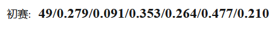

# 首届世界科学智能大赛：大气科学赛道——华东区域AI中期天气预报大赛

**初赛第49名代码 — 左家垅奋进者**




代码目录结构如下：

```
project
|–README.md
|–data
|–code
    |-- main.ipynb
    |–utils
    	|--*.py
    |–model
    	|--*.py
    |-- requirements.txt
```


`./code/mian.ipynb`代码文件中包含**`数据读取和特征选择`**，**`模型训练和预测`**

忘记设置随机种子了，但是应该影响不大...