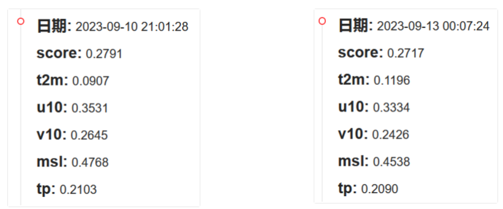
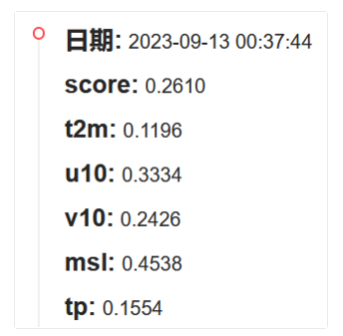

# competition

**加密**

# 实验经验

直接预测5个目标变量的未来20步信息，效果很差

单层，单个3*3的卷积，score为0.04

https://keras.io/examples/vision/conv_lstm/视频预测（ConvLSTM+Conv3D   **score : 0.04**）

预测5个变量的未来多步信息，然后迭代预测也比较差。（用同一个模型，一次预测5个变量，自回归迭代。典型的模型有FourCastNet）

一个模型预测一个变量，直接预测20步信息（效果一般，可以达到0.1左右。5个变量则需要5个模型）

使用不同的模型，每个模型预测5个变量的几步信息。（假设每个模型预测2步，预测20步就是10个模型。效果较好，可以达到0.28）**左图**

前4个变量用10个模型预测，tp降水率用10个模型预测。每个模型都是预测2步信息。**右图**

使用10个模型分别预测前4个变量的2步信息（共20步）。使用一个模型通过这4个变量回归估计得到tp。结果如下。

